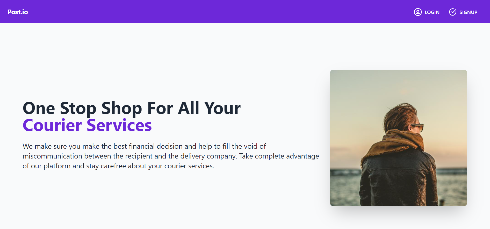
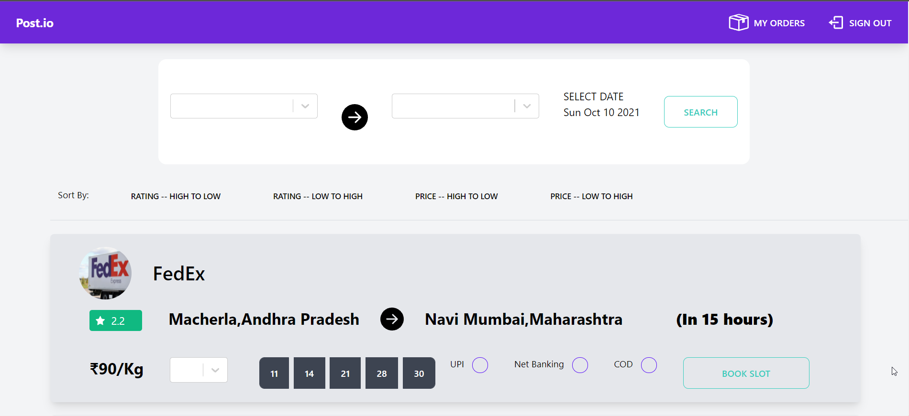
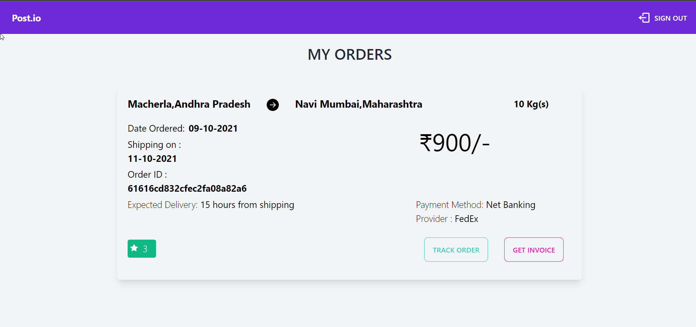
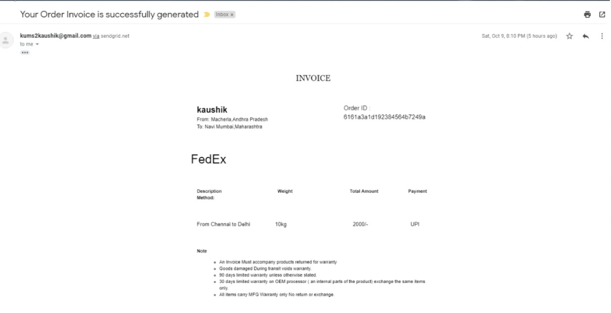
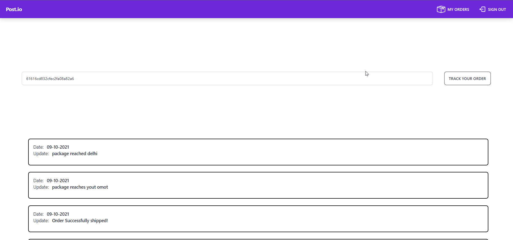

# Post.io
## Problem Statement
We wanted to make an online aggregator platform for logistics companies to let the customers choose the best service provider on the basis of rate/service quality/reach and transit time.
Live rates, Comparison, Tracking of goods, and Documentation all in one portal.
This will be one of the 1st such platforms in India.

## Our Solution
- Many different service providers set different prices for the service and we help the client pick the appropriate service by letting them compare the prices.
- We have a centralized tracking platform from where users can track their orders across multiple service providers.
- We provide various parameters to be compared such as estimated time delivery, multi available dates basis of rate, service rating, and estimated transit time.

## How does this benefit business and society? 
- Using this portal, both users and the respective companies are being benefited. 

- Logistics companies now have a more streamlined approach which may increase their sales depending on their service while people have everything to choose from at a single place and they 
   can compare and contrast the features provided to them.

- The ability to track the parcel comes as an added advantage for the users as well as the service providers.

- We also allow the companies to directly contact the admin, to make appropriate changes that can be changed hassle-free.

## How is the Solution Innovative?
- Our products help the user to avoid confusion in choosing the best courier service available. Users have multiple comparing methods and filters to choose the best service provider for their needs.
- All the details about the service from different providers are in a single place. This eliminates the need to search through all other service provider's websites to get details about the service.
- The availability of a centralized tracking system eradicates the need for different platforms.
- Automated invoice and updates feature from the Admin side.
- Convenient dashboards for the user and the Admin(Service provider) to handle their orders.
- Ability for the user to provide ratings after an order is completed. This helps us to rank different service providers available on our platform

## Screenshots
### 
<b>Homepage</b>

  

### 
<b>User Dashboard</b>

  

### 
<b>My Orders</b>

  

### 
<b>Invoice (Received via mail)</b>

  

### 
<b>Track Package</b>

  

